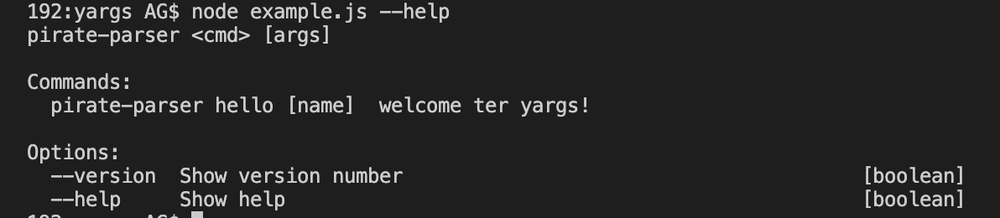
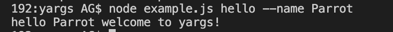

# yargs
Personal achievement for learning and implementing CLI

## Yargs Nedir?

Yargs argumanlari ogelerine ayirarak interaktif command line tools-CLI olusturmamizda yardimci olan ve iyi bir kullanici arayuzu uretmemizi saglayan bie moduldur.

Yargs ile:

- commands(komutlar) ve grouped options(opsiyonlar); "module run -n --force" gibi  
- argumanlari baz alarak dinamik help menusu
- bash tabanli kisayollar
saglanir.

## Yargs Uygulamasi

Yargs modulunu yuklemek icin terminal'den projemizi secip `npm` kullanarak asagidaki komutu yazalim:

```
$ npm install --save yargs
```
Daha sonra ise, **example.js** dosyasi olusturalim ve asagidaki kod blogu ile baslayalim:

```
#!/usr/bin/env node

require('yargs')
  .scriptName("pirate-parser")
  .usage('$0 <cmd> [args]')
  .command('hello [name]', 'welcome ter yargs!', (yargs) => {
    yargs.positional('name', {
      type: 'string',
      default: 'Cambi',
      describe: 'the name to say hello to'
    })
  }, function (argv) {
    console.log('hello', argv.name, 'welcome to yargs!')
  })
  .help()
  .argv

```
Su sekilde bir cikti almamiz gerekiyor:



Daha sonra ise, hello komutunu calistiralim:

```
$ node example.js hello --name Parrot
```



Yukaridaki ornekte de goruldugu uzere, yargs modulu ile argumanlar arasinda durum(positional) degiskenlik gosteren bir eylem gerceklesti. Bunun haricinde, adlandirilmis bagimsiz degiskenler deger cifti olarak atandi ve bayraklar(flags) uygulamaya bilgi saglayan bir anahtar olarak cikti almamizi sagladi.
